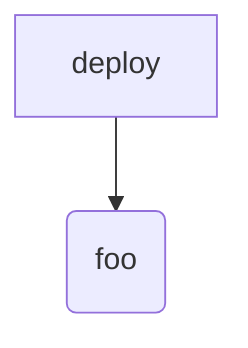
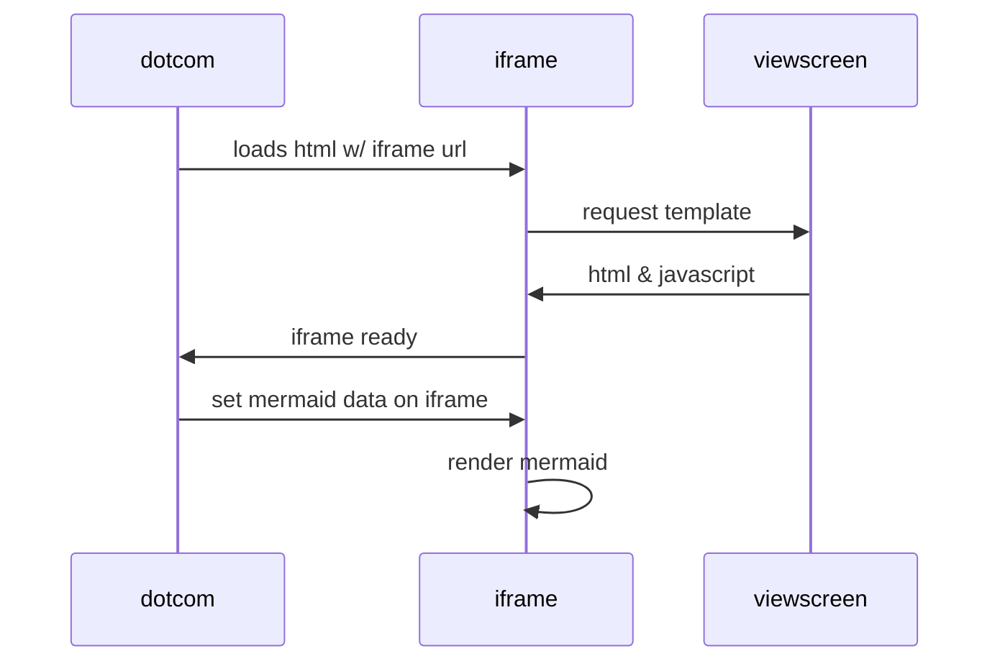

 

[Home](../README.md) \| [Getting started](docs/getting-started.md) \|  [Postman](docs/postman.md) \| [Swagger](docs/swagger/index.html)

# Developer Hub
The Tax Agile Developer Hub contains resources for developers integrating with Tax Agile. 

It includes [API Swagger OAS3 docs](docs/swagger/index.html), [sample API requests](docs/postman.md) and documentation to [get started](docs/getting-started.md).

The Hub is hosted on GitHub and you can report issues to us using the GitHub Issues functionality.

# Overview of the API

In this version of the API you have methods to authenticate and invoke the VAT Determination API.

